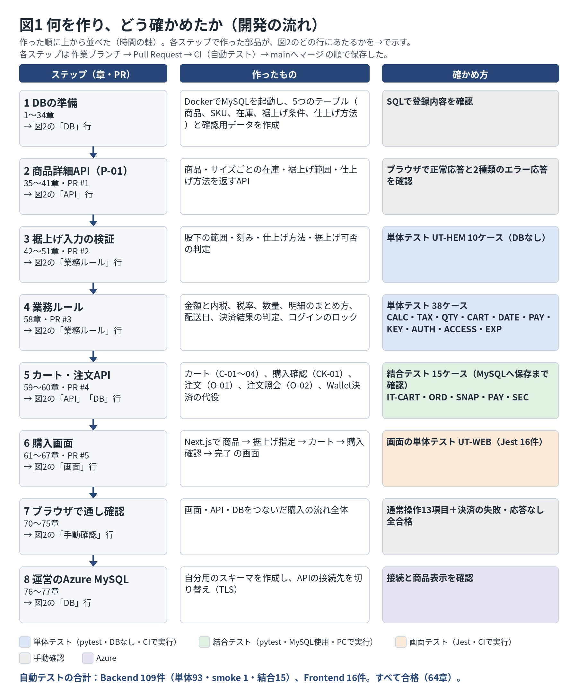
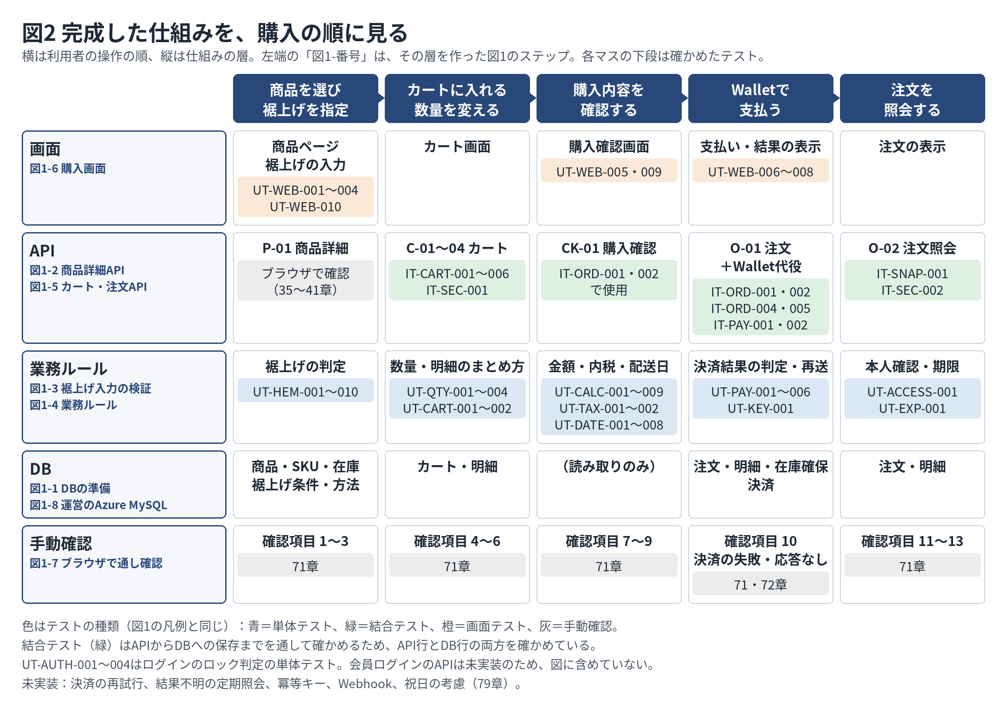

# GU ECサイト 開発演習 Lv3

Tech0個人宿題。作成者：平田真子（12期）。GUのECサイトを題材に、要求・要件・設計・テスト設計・実装・検証を進める学習用の非公式アプリです。実際の商品購入・課金は行いません。

**ローカルで購入経路が動作します。** 商品詳細 → 裾上げ指定 → カート → 購入確認 → 模擬Wallet決済 → 注文完了を、ブラウザで確認しました（2026-09-21）。DBは運営のAzure MySQLに自分用のスキーマを作成し、APIから接続できることも確認済みです。Azureへのデプロイは未実施です。

## 全体の流れ（図解）

何を作り、どう確かめたかの全体像です。同じ図はマニュアル第9版の冒頭にもあります。詳しくは図中の章を参照してください。





## 主題と対象範囲

実機調査（2026/8/27）の課題は、裾上げの可否・料金・追加日数が購入判断の画面で分かりにくいことと、購入手続きの入力負荷です。実装対象を「裾上げを指定し、内容を確認してWalletで購入する」経路に絞っています。

- 画面：Next.js、API：FastAPI、DB：MySQL、テスト：pytest／Jest。
- DBは、PC上のDockerで動くMySQL 8.4（開発・テスト用）と、運営のAzure Database for MySQLに作成した自分用のスキーマの2つを、設定ファイルで切り替えて使います。
- デプロイ先の前提はMicrosoft Azure、DBはAzure Database for MySQL Flexible Server。Vercel・Streamlitは使いません。
- 会員購入、実Walletとの連携、決済結果不明時の自動確定などは未実装です。業務ルールの単体テストがあっても、対応するAPIが実装済みとは限りません。

## 日程と進捗

運営からの回答として共有された変更後の日程を使います。旧READMEの「9/30 Azureデプロイ」は以下に置き換えます。

| 期限 | 目標 | 現状 |
|---|---|---|
| 9/30 | ローカルで動作 | ゲストの模擬購入経路を確認済み。Azure MySQLへのスキーマ作成・接続も確認済み |
| 10/7 | レビュー | 指摘の整理・対応はこれから |
| 10/14 | デプロイ | Azureへの公開は未実施 |

セキュリティチェック、ログ・アラート、閉域化の変更後の期限は、この記録では確定していません。

要求・要件・設計・テスト仕様書は `docs/01_requirements_要求仕様書/` から `docs/04_test_テスト仕様書/` にあります。設計22.1のNode.js・Prisma・PostgreSQLという技術選定は実装と不一致で、改訂が必要です。テスト仕様書はファイル名だけで版を判断せず本文を確認します。

開発手順・文法解説・実施記録は [マニュアル第9版](docs/05_dev_開発準備マニュアル/GU_EC_Lv3_開発準備マニュアル_第9版.docx) にまとめています。**この課題を手元で再現する場合は、マニュアル第9版の78章から読んでください。**旧版の手順は当時の記録です。現在のソースに古い `main.py` の全文を貼り直さないでください。

## 実装済みのAPI

以下は `/api/v1` を先頭に付けたパスです。

| メソッド | パス | 内容 |
|---|---|---|
| GET | `/health`、`/health/db` | 起動・DB接続確認 |
| GET | `/products/{productId}` | P-01 商品とSKU、在庫、裾上げ条件 |
| GET | `/carts/current` | C-01 カート取得 |
| POST | `/carts/current/items` | C-02 明細追加 |
| PATCH | `/carts/current/items/{cartItemId}` | C-03 数量・裾上げ変更 |
| DELETE | `/carts/current/items/{cartItemId}` | C-04 明細削除 |
| POST | `/checkout/preview` | CK-01 最新金額・配送日・在庫不足の確認 |
| POST | `/orders` | O-01 在庫確保、注文作成、模擬決済 |
| GET | `/orders/{orderId}` | O-02 本人の注文照会 |

ゲスト識別はHttpOnly Cookieを使い、トークンはDBにハッシュで保存します。注文確定時の商品価格・裾上げ情報は注文明細へ保存し、後の商品情報変更の影響を受けないようにしています。

## ローカルで起動する

Windows PowerShellで、`C:\Users\mako_\Downloads\GU_EC_repo_skeleton\repo` を基準に操作します。動作確認時の環境はPython 3.11.9、Node.js 24.15.0、npm 11.12.1、Docker Desktopです。依存ライブラリは各ロック・要件ファイルを使います。

### 初回だけ行う準備

既存の `.env` やDBがある場合は、作り直さず次の「普段の起動」へ進みます。

```powershell
if (-not (Test-Path .env)) { Copy-Item .env.example .env }
py -3.11 -m venv .venv
.\.venv\Scripts\python.exe -m pip install -r backend\requirements.txt
```

`.env` の `MYSQL_ROOT_PASSWORD` と `MYSQL_PASSWORD` を自分で決めた値へ変更して保存します。UTF-8で保存し、実際のパスワードをGitへ入れません。Dockerは `MYSQL_PASSWORD` で `gu_app` を初期作成し、Backendは同じ値で接続します。起動済みDBのパスワードは `.env` の変更だけでは変わりません。

Docker Desktopを起動し、PowerShellで実行します。

```powershell
docker compose up -d db
docker compose cp ./scripts/sql db:/tmp/sql
docker compose exec db mysql --default-character-set=utf8mb4 -u gu_app -p gu_ec_mako
```

パスワード入力中は文字が表示されません。`mysql>` になったら、以下を**1行ずつ**実行します。エラーが出たら次へ進まず内容を確認してください。

```sql
SOURCE /tmp/sql/001_product_tables.sql;
SOURCE /tmp/sql/002_alteration_tables.sql;
SOURCE /tmp/sql/003_seed_product.sql;
```

003の登録にエラーがないことを確認し、同じMySQL接続で確定します。003にはCOMMITが含まれていません。

```sql
COMMIT;
SOURCE /tmp/sql/004_cart_tables.sql;
SOURCE /tmp/sql/005_order_tables.sql;
SHOW TABLES;
exit;
```

001・002・004・005で合計11テーブルです。これらは初回作成用で、既存テーブルに繰り返し流すマイグレーションではありません。003で失敗した場合はCOMMITせずROLLBACKし、原因を直します。

### 普段の起動

ターミナル1をrepoで開き、Docker Desktopを起動した状態で実行します。

```powershell
docker compose up -d db
.\.venv\Scripts\python.exe -m uvicorn main:app --app-dir backend --reload --reload-dir backend
```

ターミナル2をrepoで開きます。`npm ci` は初回または依存ファイル変更時に実行します。

```powershell
cd frontend
npm ci
npm run dev
```

ブラウザは [http://127.0.0.1:3000](http://127.0.0.1:3000)。途中で `localhost` に替えるとCookieが別扱いになるので統一します。DB接続確認は [http://127.0.0.1:8000/api/v1/health/db](http://127.0.0.1:8000/api/v1/health/db) です。

Next.jsが `/api/v1/*` をFastAPIへ中継します。標準設定ではFrontendの `.env.local` は不要です。APIの起動先を変える場合だけ `frontend/.env.example` を参考に `BACKEND_URL` を設定し、Next.jsを再起動します。FrontendにDBのパスワードは設定しません。

終了時は各サーバーのターミナルでCtrl+C。DBはrepoで `docker compose stop db`。再開時にSQLの再投入は不要です。

## 動作確認の記録

2026-09-21に、本人PCのブラウザで購入経路を操作して確認しました。詳細は [動作確認記録](docs/05_dev_開発準備マニュアル/動作確認記録_20260921.md) とマニュアル第9版71〜73章にあります。

| 区分 | 確認内容 | 結果 |
|---|---|---|
| 通常操作 | 裾上げ範囲の表示と入力エラー、明細の合算・分割、数量変更・削除、金額、入力不足、注意表示、注文、再読み込み、注文後の空カート、他人の注文の非表示の13項目 | すべて合格 |
| 決済失敗 | `WALLET_MOCK_RESULT=FAILED` で購入 | 注文は未確定、確保した在庫を解放 |
| 応答なし | `WALLET_MOCK_RESULT=TIMEOUT` で購入 | 202と確認中の表示、在庫の確保を維持 |

代表例として、S・ミシン仕上げ・股下74cm・1点の注文（GU20260921-200425）は、商品1,000円＋裾上げ300円＋送料500円＝合計1,800円、うち消費税163円、配送予定日2026-09-28でした。配送日と注文番号はその実行時の記録で、固定の期待値ではありません。

Windowsでは、ターミナルを閉じただけでは前回のサーバーが残り、新しい設定が効かないことがあります。止め方はマニュアル第9版73章を参照してください。

## テスト

| 区分 | 仕様書ケース | 実行結果と根拠 |
|---|---|---|
| Backend UT | 48ケース | 業務UT93件＋smoke1件＝94件。本人PCのpytestログ |
| Backend IT | 40ケース中15ケース | カート7件＋注文8件。本人PCでUT等と合わせ109 passed |
| Frontend UT | UT-WEB-001〜010の10ケース | 条件の分岐と補足を含むJest16件。本人PCで合格 |
| ST・UAT | ST16行・UAT6行 | 全件実施の記録なし。購入画面の確認と区別 |
| CI | Backend・Frontendの2ジョブ | PR #5画面で2 checks passedを確認 |

仕様書のUT計58ケースと、pytest/Jestの実行件数は異なります。Frontendの16件はAPI応答を差し替える単体テストであり、実DBのITではありません。

### Backend通常テスト

repoから実行します。CIもDBを使うITは実行しません。

```powershell
cd backend
..\.venv\Scripts\python.exe -m pytest -q
cd ..
```

記録上は `94 passed, 2 skipped`。`2 skipped` はITの2モジュールを対象外にした表示です。

### Backend結合テスト

**ローカルの破棄可能な開発用DBにだけ実行します。** テストは注文・カートを削除し、確認用商品の価格と在庫を初期化します。Azureや保存したい注文のあるDBに向けて実行しないでください。先に `.env` と現在の環境変数の接続先を確認します。

```powershell
cd backend
$env:RUN_IT = "1"
try {
    ..\.venv\Scripts\python.exe -m pytest -q
} finally {
    Remove-Item Env:RUN_IT -ErrorAction SilentlyContinue
}
cd ..
```

記録上は `109 passed`。内訳は94＋15です。実施したITはCART-001〜006、SEC-001・002、ORD-001・002・004・005、SNAP-001、PAY-001・002。残るIT25ケースは未実施です。

### Frontend

repoから実行します。

```powershell
cd frontend
npm test
npm run typecheck
npm run build
cd ..
```

本人PCのJestは16件合格、build成功。型チェックもCIの実行項目です。CIはPython 3.12、Node.js 24を指定しています。

## 実装で採用した判断と制限

- 入力不備は422。エラーは `errorCode`・`message`・`fieldErrors`・`traceId`。
- 在庫不足はテストケースの `OUT_OF_STOCK`（設計の `STOCK_SHORTAGE` と相違）。
- 税率不正は `INVALID_TAX_RATE` を追加。購入キーの内容違いは単体ルールで `IDEMPOTENCY_CONFLICT`（設計は `IDEMPOTENCY_KEY_REUSED`）。APIへの冪等キー組込みは未実装。
- 裾上げありでの不足は `ALTERATION_INPUT_REQUIRED`。存在しない方法は `INVALID_ALTERATION_METHOD`、対象外は `ALTERATION_NOT_AVAILABLE`。刻み幅違反は `INSEAM_OUT_OF_RANGE`。
- ロック判定は `ACCOUNT_LOCKED`、認証不一致は `INVALID_CREDENTIALS`。認証ルールのテストは会員ログインAPIの完成を意味しない。
- 税率10%・送料500円は `settings.py` の固定値。祝日カレンダーは未実装で配送日は土日除外。
- 他人の明細の変更は404、削除は何も変更せず204。他人の注文照会は404。
- 注文照会Cookieは直近1件分。新しい注文後は前の注文を同じCookieで照会できない。
- `WALLET_MOCK_RESULT` は `SUCCEEDED`（既定）・`FAILED`・`TIMEOUT`。TIMEOUTはUNKNOWNとし在庫確保を保持。注文画面の再取得はDBを読むだけで、Walletへ照会しない。
- 決済再試行O-03、Webhook W-01、UNKNOWN定期照会、実Wallet、会員購入、Azureデプロイは未実装。
- 画面は送信中の連打と通信途絶後の同一画面での再送を抑止する。再読み込みや複数タブをまたぐ二重注文防止にはBackendの冪等性対応が必要。

## Gitと実施履歴

| PR | 主な変更 | コミット |
|---|---|---|
| #1 | ローカルDB・商品詳細API | b157c00など |
| #2 | 裾上げ検証 | aa9c666 |
| #3 | Backendの追加業務ルールUT | 4018b04 |
| #4 | カート・購入確認・注文・模擬Wallet・IT | 2490912、08d382a |
| #5 | 購入画面・UT-WEB・Frontend CI | b9ff351、マージ15dce7c |

PR #5マージ後、本人PCで `git pull --ff-only` によりmainを15dce7cへ更新し、`git status --short` が空であることを確認しました。

`main`には直接コミットせず、作業ブランチで変更してPRを作成します。PRには対応ケースIDと実行結果を記載し、CI成功後にCreate a merge commitでマージします。

```powershell
git switch main
git pull --ff-only
git switch -c feature/next-task
# 作業後、対象ファイルを選んでgit addする
git --no-pager diff --cached --stat
```

`--no-pager` はlessの閲覧画面を開かない指定です。`.env`、`.venv`、`node_modules`、`.next` はコミットしません。

## 運営のAzure MySQLを使う

課題の条件に合わせ、運営が用意したAzure Database for MySQL（フレキシブルサーバー）に自分用のスキーマ `gu_ec_mako` を作成しています。詳しい手順と、つまずいたときの対処はマニュアル第9版76・77章にあります。サーバー名・ユーザー名・パスワードは運営から共有されたものを使い、このリポジトリには書きません。

**1. スキーマとテーブルを作る**（初回だけ）

Dockerのmysqlコマンドを借りて接続します。パスワードはコマンドに書かず、入力を求められたときに貼り付けます。

```powershell
docker compose up -d db
foreach ($f in "001_product_tables","002_alteration_tables","003_seed_product","004_cart_tables","005_order_tables") { docker compose cp "./scripts/sql/$f.sql" "db:/tmp/$f.sql" }
docker compose exec db mysql --default-character-set=utf8mb4 -h <サーバー名>.mysql.database.azure.com -u <ユーザー名> -p --ssl-mode=REQUIRED
```

```sql
CREATE DATABASE gu_ec_mako CHARACTER SET utf8mb4 COLLATE utf8mb4_unicode_ci;
SOURCE /tmp/001_product_tables.sql;
SOURCE /tmp/002_alteration_tables.sql;
SOURCE /tmp/003_seed_product.sql;
COMMIT;
SOURCE /tmp/004_cart_tables.sql;
SOURCE /tmp/005_order_tables.sql;
SHOW TABLES;
```

`--default-character-set=utf8mb4` を省くと日本語が化けて保存されます。共有サーバーなので、他の人は `gu_ec_mako` ではなく自分用の名前を使ってください（マニュアル78章7節）。

**2. `.env.azure` を作る**（repo直下。`.gitignore` で除外済み）

```
MYSQL_HOST=<サーバー名>.mysql.database.azure.com
MYSQL_PORT=3306
MYSQL_DATABASE=gu_ec_mako
MYSQL_USER=<ユーザー名>
MYSQL_PASSWORD=<パスワード>
MYSQL_SSL=true
```

パスワードは引用符で囲まずに書きます。`db.py` は `URL.create()` で値を部品ごとに渡すため、パスワードに `&` や `@` が含まれていても、接続URLの区切りと誤解されません。

**3. Azureへ接続してAPIを起動する**

```powershell
$env:APP_ENV_FILE = ".env.azure"
.\.venv\Scripts\python.exe -m uvicorn main:app --app-dir backend --reload --reload-dir backend
```

`MYSQL_SSL=true` のとき、`db.py` はcertifiの証明書一覧でサーバーを検証してTLS接続します。ローカルへ戻すときは、Ctrl+Cで止めて `Remove-Item Env:APP_ENV_FILE` を実行してから起動し直します。**`APP_ENV_FILE` を指定したまま結合テスト（`RUN_IT=1`）を実行しないでください。** テストが接続先の注文・カートを削除します。

## 参考

- [Git pull](https://git-scm.com/docs/git-pull)
- [SQLAlchemy 接続URL](https://docs.sqlalchemy.org/en/20/core/engines.html)
- [MySQL Docker公式イメージ](https://hub.docker.com/_/mysql)
- [Next.js rewrites](https://nextjs.org/docs/app/api-reference/config/next-config-js/rewrites)
